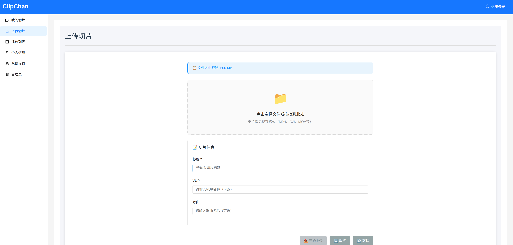

# ClipChan - 切片转Bilibili直播服务

ClipChan 是一款将视频切片自动转换为直播流并推送到哔哩哔哩(Bilibili)直播平台的服务工具，帮助内容创作者轻松实现视频片段的直播化展示。

## 功能特点

- 视频切片管理与组织
- 自动生成直播流
- 无缝对接Bilibili直播平台
- 支持多种视频格式
- 简洁易用的Web界面
- 高效的视频流处理

## screenshots

### 切片管理


### 上传切片


### 播放列表


### 个人资料


## 系统要求

- Rust 1.70+
- Node.js 20+
- SQLite
- FFmpeg
- GStreamer
- libssl

## 快速开始

### Docker构建与部署 (推荐)

```bash
# 克隆仓库
git clone https://github.com/pcmid/clipchan.git
cd clipchan

# 构建Docker镜像
docker build -t clipchan:latest .

# 运行容器
docker run -d -p 80:80 \
  -v $(pwd)/data:/data \
  -v $(pwd)/config:/config \
  --name clipchan clipchan:latest

# 查看容器日志
docker logs -f clipchan
```

使用Docker Compose:

```bash
# 创建docker-compose.yml文件
cat > docker-compose.yml << EOF
version: '3'
services:
  clipchan:
    build: .
    ports:
      - "80:80"
    volumes:
      - ./data:/data
      - ./config:/config
    environment:
      - RUST_LOG=info
EOF

# 启动服务
docker-compose up -d

# 停止服务
docker-compose down
```

### 后端服务

```bash
# 克隆仓库
git clone https://github.com/pcmid/clipchan.git
cd clipchan

# 安装依赖并构建
cargo build --release

# 配置环境变量（或使用.env文件）
cp .env.example .env

# 启动服务
cargo run --release
```

### 前端界面

```bash
# 进入前端目录
cd frontend

# 安装依赖
yarn install && yarn add -D vite

# 启动开发服务器
yarn dev

# 构建生产版本
npx vite build
```

## 配置说明

### 配置文件

ClipChan 支持两种配置方式：环境变量和配置文件。

#### 配置文件位置

- 在本地运行时：`./clipchan.toml`
- 在Docker中运行时：`/config/clipchan.toml`

#### TOML格式配置示例

```toml
# 服务器配置
port = 3000
host = "0.0.0.0"
# 数据库配置
database_url = "sqlite://./data/clipchan.db?mode=rwc"
# 临时文件目录
tmp_dir = "./data/temp"

# 存储配置
[storage]
type = "local"
[storage.local]
path = "./data/clips"

# 直播配置
[stream]
# 视频分辨率
video_height = 1080
video_width = 1920
# 视频帧率
video_framerate = 60
# 视频码率
video_bitrate = 4000 # 4000 kbps
# h264编码预设
video_speed = "faster"

# 音频采样格式
audio_sample_format = "S16LE"
# 音频采样率
audio_rate = 44100
# 音频码率
audio_bitrate = 128000 # 128 kbps
# 音频通道数
audio_channels = 2

# 标题字体
title_font = "Arial 20"
# 标题位置
title_halign = "right"
title_valign = "top"
```


### 环境变量

主要配置项（在`.env`文件中设置）：

| 配置项                            | 说明 | 默认值 |
|--------------------------------|------|--------|
| CLIPCHAN__PORT                 | 服务监听端口 | 3000 |
| CLIPCHAN__DATABASE_URL         | 数据库连接URL | sqlite://./data/clipchan.db?mode=rwc |
| CLIPCHAN__TMP_DIR              | 临时文件目录 | ./data/temp |
| CLIPCHAN__STORAGE__LOCAL__PATH | 视频切片存储路径 | ./data/clips |
| RUST_LOG                       | 日志级别设置 | clipchan=debug,bilive=debug,sea_orm=warn,sqlx=warn |

...

配置优先级：命令行参数 > 环境变量 > 配置文件 > 默认值

## 开源协议

[MIT](https://github.com/pcmid/clipchan/blob/main/LICENSE)
